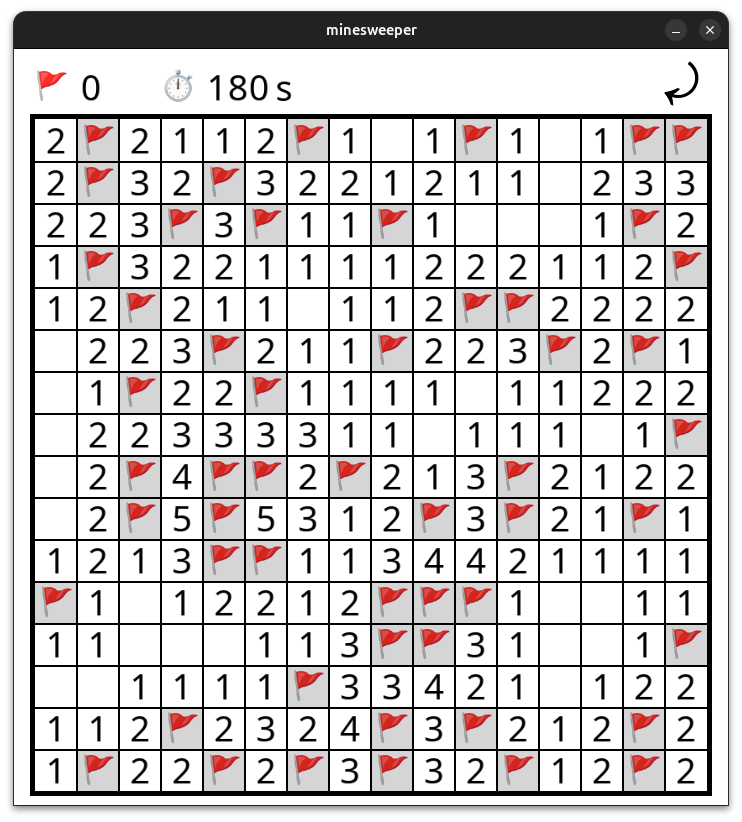

# minesweeper

### « A stressful job »



<br/>

The project is written for Linux. You need the following package (SDL2):

```
libsdl2-dev
```

Use `make` to compile the game. Type `./minesweeper` to launch.

You can specify paramaters formatted as followed:

```
./minesweeper [map width] [map height] [bomb percentage]
```

<br/>

Use `LMB` on the map to discover a cell, and `RMB` to put a flag on it.

Use `LMB` on the right top corner of the window to restart the game.

When a game is over, you can also use `Enter`.

<br/>

In order to win the game, you have to discover every safe cells.
